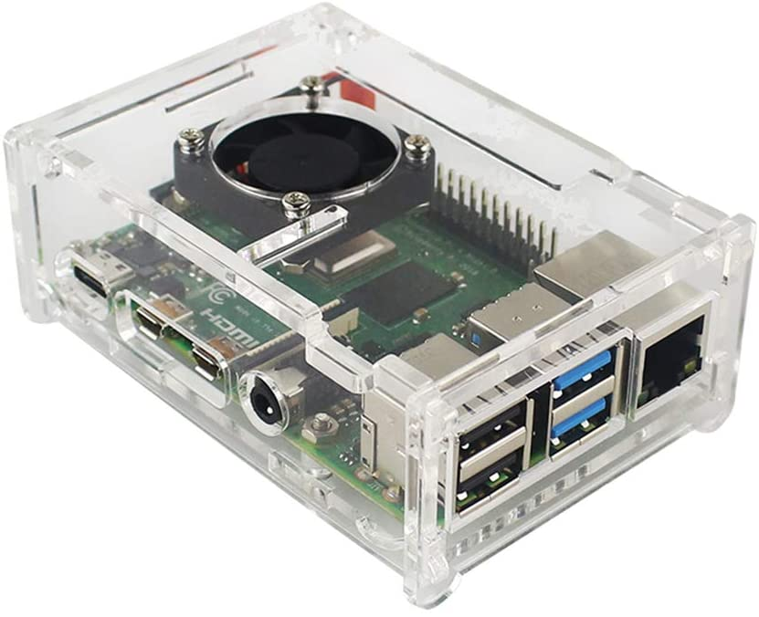

A ideia do jogo é aproximar ao máximo a criança com o mundo da lógica de programação, portanto, a natureza dos desafios é similar aos problemas que encontramos ao desenvolver um site da web ou um aplicativo para celular.

A criança que está jogando controla o herói (Artú) criando uma lista de instruções pra ele, que será executada em ordem, como uma lista de receitas.

Essa lista de instruções deverá conter o passo-a-passo necessário para Artú completar de fase: andar, girar, falar, somar, subtrair, repetir, etc.

O objetivo principal da jogadora será cumprir os níveis do jogo, que terão associação com os capítulos do livro que contém a narrativa detalhada.

O jogo será disponibilizado gratuitamente pela internet, porém, nosso projeto também contempla a distribuição de equipamentos pra instituições voltadas à atenção infantil. Os equipamentos distribuídos serão o suficiente pra criança conseguir jogar e ler a versão online do livro.

Pra reduzir o custo hardware e logística, usaremos como computador, Raspberry PI, que é um computador que cabe na palma da mão, consome pouca energia e só depende de monitor, teclado e mouse pra ser usado:

## Distribuição

Todas as doações recebidas serão utilizadas durante o processo de compra e distribuição dos equipamentos, que são:

- Raspberry PI (2, 3 ou 4)
- Teclado e mouse
- Fonte 5v para Raspberry PI
- Monitor ou mini-projetor

O valor total do conjunto acima pode variar entre 300 e 700 reais, idealmente, deve ser utilizado por 1 ou 2 crianças pra ter o máximo de proveito.

Na entrega dos livros e computadores, fazemos uma introdução ao universo de Artú, uma atividade de personalização da capinha do Raspberry PI, que tem o objetivo de aproximar a criança com seu novo computador, que vai ser a sua janela pro conhecimento digital.
